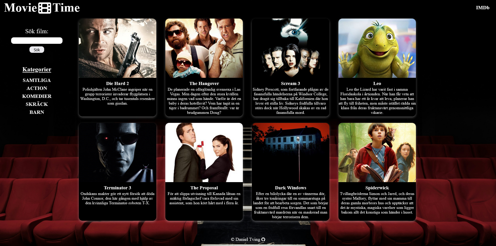

# Film Distributor

This project is a responsive web application built as part of the entrance exam for the Fullstack Developer program at Medieinstitutet. It allows users to browse a collection of movies, search for titles, and explore categories. While the interface is fully designed, functionalities like searching and filtering by categories are placeholders and not yet implemented. The primary focus of this project was on HTML and CSS to create a visually appealing and responsive design.

## Table of contents

- [Film Distributor](#film-distributor)
  - [Table of contents](#table-of-contents)
  - [Overview](#overview)
    - [Screenshot](#screenshot)
    - [Links](#links)
    - [Features](#features)
    - [Built with](#built-with)
    - [What I learned](#what-i-learned)
    - [Useful resources](#useful-resources)
  - [Author](#author)
  - [Acknowledgments](#acknowledgments)

## Overview

### Screenshot



### Links

- Live Site URL: [DT Code](https://film-distributor.dtcode.se/)

### Features

- Interactive Design: Movie cards with images, titles, and descriptions for an engaging browsing experience.
- Search and Category Filtering (Planned): The interface includes a search bar and category navigation, though these features are placeholders and not yet functional.
- Responsive Layout: The application adapts seamlessly to different screen sizes, making it accessible on mobile, tablet, and desktop.

### Built with

- HTML5: For semantic and structured content.
- CSS3: For responsive and visually appealing styling.
  - Google Fonts for custom typography.
  - Flexbox for layout alignment.
  - Media queries for device-specific optimization.
- JavaScript (ES6+): Minimal interactivity, with placeholders for future features.

### What I learned

This project emphasized the importance of:
- Crafting a responsive and visually consistent user interface using only HTML and CSS.
- Planning for future functionality, such as search and filtering, by creating an intuitive layout and structure.
- Utilizing CSS Flexbox and media queries to ensure the design works across various devices.

The following code snippet demonstrates the placeholder functionality for the search button:

```js
const searchBtn = document.getElementById('search-btn');

function searching() {
    alert('Error, knappen fungerar inte');
}

searchBtn.addEventListener('click', searching);
```

This placeholder highlights how the design anticipates future development of full functionality.

### Useful resources

- [MDN Web Docs: Flexbox Guide](https://developer.mozilla.org/en-US/docs/Web/CSS/CSS_flexible_box_layout/Basic_concepts_of_flexbox) - Essential for understanding Flexbox's role in creating responsive layouts.
- [CSS Tricks: A Complete Guide to Media Queries](https://css-tricks.com/a-complete-guide-to-css-media-queries/) - Provided guidance on creating device-specific styles.

## Author

- GitHub - [@dantvi](https://github.com/dantvi)
- LinkedIn - [@danieltving](https://www.linkedin.com/in/danieltving/)

## Acknowledgments

Special thanks to Medieinstitutet for the creative and challenging entrance exam. This project focused on honing skills in HTML and CSS, laying the groundwork for future development of full functionality.
